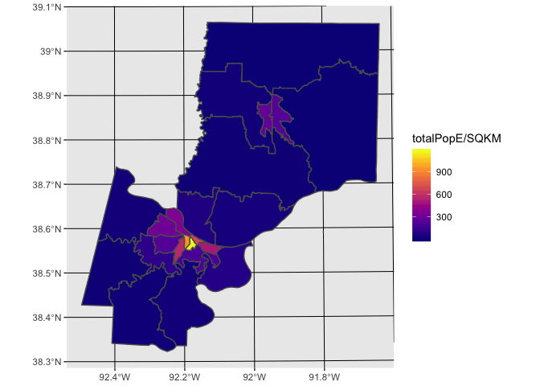

Lab 04 Replication Notebook
================
Christopher Prener, Ph.D.
(February 24, 2018)

Introduction
------------

This is the replication notebook for Lab-04 from the course SOC 4650/5650: Introduction to GISc.

Load Dependencies
-----------------

The following code loads the package dependencies for our analysis:

``` r
# tidyverse
library(ggplot2) # data plotting

# other packages
library(here) # working directory tools
```

    ## here() starts at /Users/chris/GitHub/SOC5650/LectureRepos/lecture-05/Lab-04/lab-04-replication

``` r
library(sf) # spatial data tools
```

    ## Linking to GEOS 3.6.1, GDAL 2.1.3, proj.4 4.9.3

``` r
library(viridis) # color palettes
```

    ## Loading required package: viridisLite

Load Data
---------

The following code loads the data package and assigns our data to a data frame in our global environment:

``` r
jeffTracts <- st_read(here("data","MO_DEMOS_JeffCityRegion","MO_DEMOS_JeffCityRegion.shp"), 
                      stringsAsFactors = FALSE)
```

    ## Reading layer `MO_DEMOS_JeffCityRegion' from data source `/Users/chris/GitHub/SOC5650/LectureRepos/lecture-05/Lab-04/lab-04-replication/data/MO_DEMOS_JeffCityRegion/MO_DEMOS_JeffCityRegion.shp' using driver `ESRI Shapefile'
    ## Simple feature collection with 23 features and 12 fields
    ## geometry type:  POLYGON
    ## dimension:      XY
    ## bbox:           xmin: 1641796 ymin: 906429.8 xmax: 1886321 ymax: 1176688
    ## epsg (SRID):    NA
    ## proj4string:    +proj=tmerc +lat_0=35.83333333333334 +lon_0=-92.5 +k=0.9999333333333333 +x_0=500000.0000000001 +y_0=0 +datum=NAD83 +units=us-ft +no_defs

Create a County Population Map in `R`
-------------------------------------

### Question 10

The following code creates the map itself:

``` r
ggplot() +
  geom_sf(data = jeffTracts, mapping = aes(fill = totalPopE/SQKM), color = "#5d5d5d") +
  scale_fill_viridis(option = "plasma")
```



### Question 11

This code block saves the map to the `results` subfolder:

``` r
ggsave(here("results","lab-04-countyMap-R.png"), dpi = 300)
```

    ## Saving 7 x 5 in image
